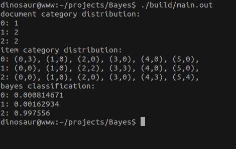

朴素贝叶斯分类器
==============

# 基本描述
c++11实现了文本分类的基本方法，使用朴素贝叶斯文本分类算法。

# 使用方法

###1. 创建字典
```c++
    Dictionary dictionary = { "football", "match", "coldplay", "greenday", "java", "python" };
    Document<string>::set_modeling(WordBagModel(&dictionary));
```

###2. 创建待分类的Document
```c++
    Document<string> d1("I like football watching football matches every week occasionally playing football game");
    Document<string> d2("My favorite band is coldplay and greenday I really like the viva la vida ");
    Document<string> d3("i often use java but in fact i dont like java at not i like python because life is short i use python");
    Document<string> d4("in my opinion coldplay is more famous than greenday although i also like greenday");
    Document<string> d5("what is java i only use python python is easy");
    Document<string> d6("which is better java or python");
```

###3. 定义Training对象，并添加训练数据
```c++
    Training<string> t(category, dictionary.size());
    
    t.add_document(d1, 0);
    t.add_document(d2, 1);
    t.add_document(d3, 2);
    t.add_document(d4, 1);
    t.add_document(d5, 2);
```

###4. 训练
```c++
    t.training();
```

###5. 朴素贝叶斯分类
```c++
    auto result = t.bayes(d6);
```

# 分类效果
 